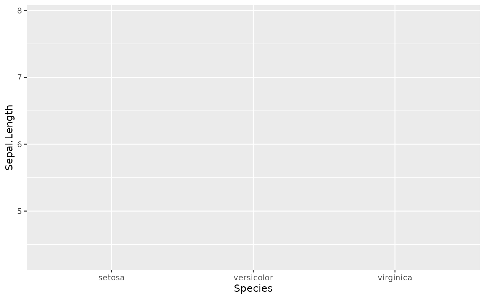
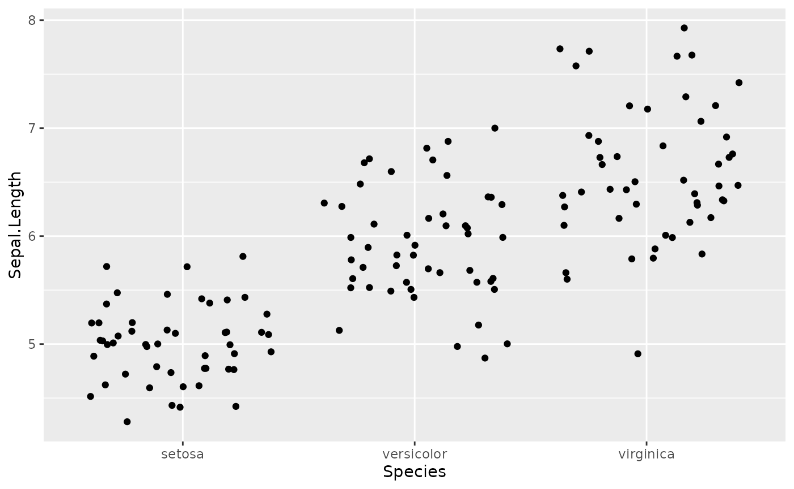
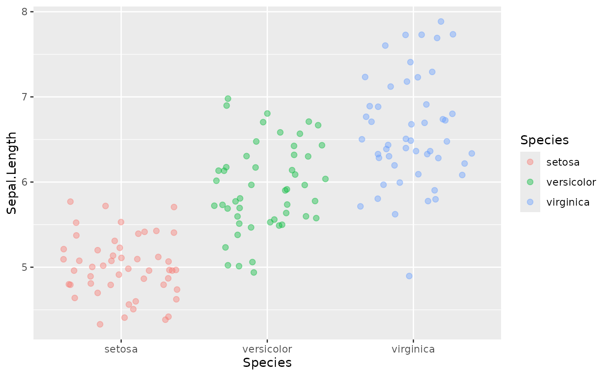
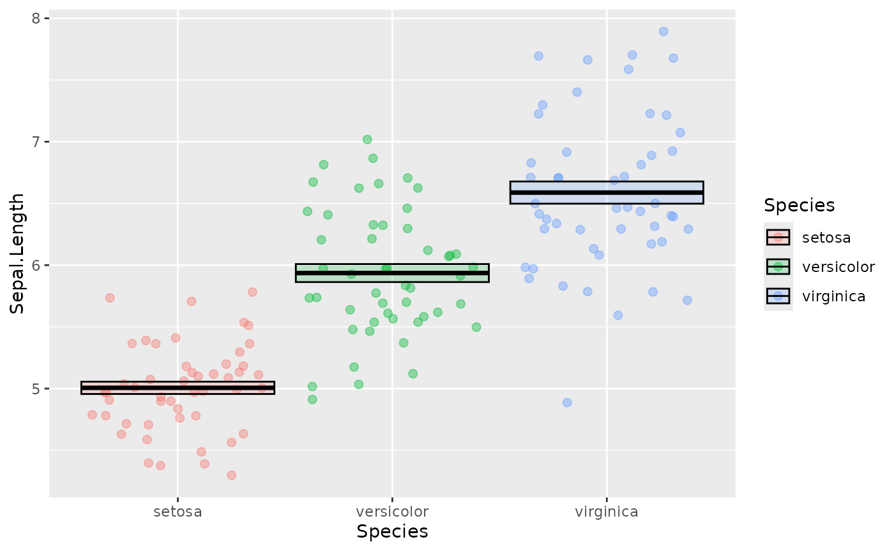
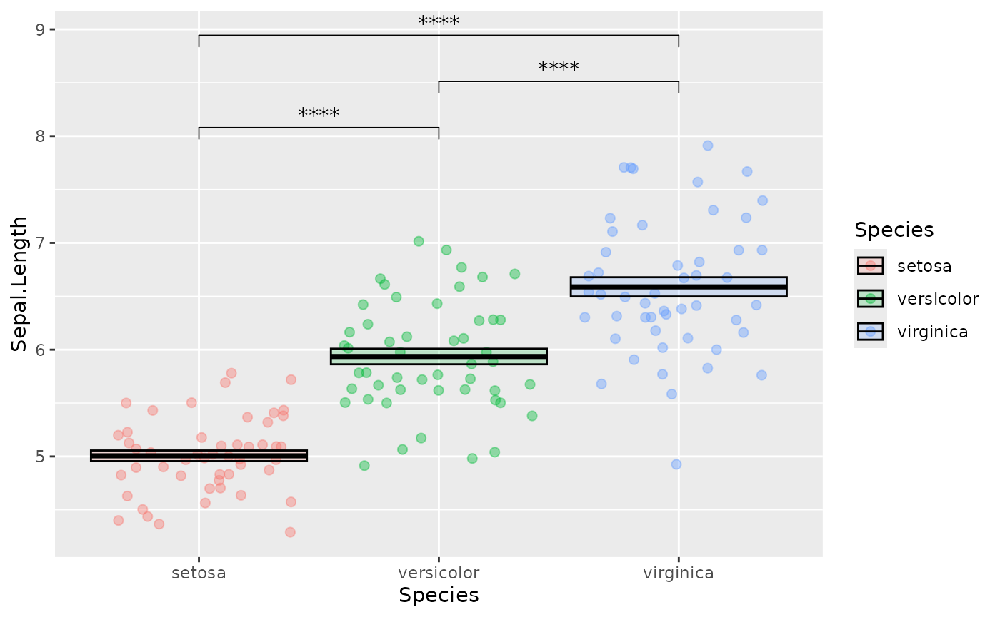
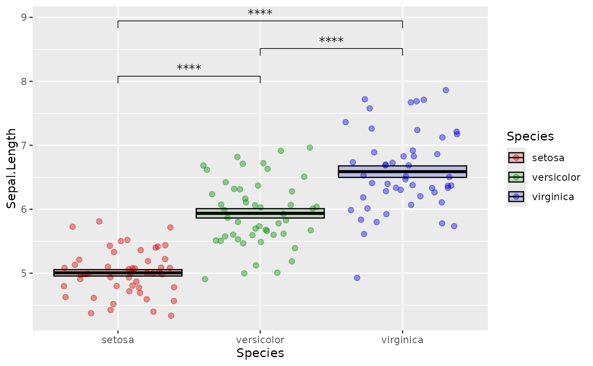
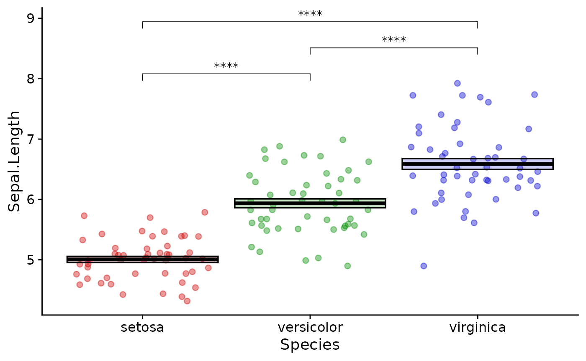
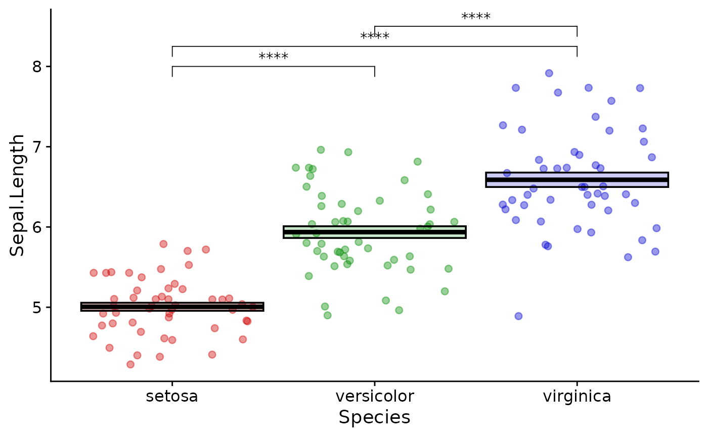

# Core Lesson 3: Next Level R

## Introduction

This lecture introduces more advanced concepts in R. You should have
some level of comfort with the basic data types and structures and how
to assign values to variables. Here we will learn ways in which R can
automate complex or repetitive tasks in a way that is error-resistant.

## Scope

Scope is a concept in computer science that has to do with how the names
and values of objects relate to each other. It refers to the part of a
program where a name representing a piece of data or a function is
valid.

In R, functions are “first-class”. This means they can live alongside
data within the same scope.

If you have a function or piece of data in your global environment with
the same name as a different function or piece of data in a certain
package, R will have to decide which you are referring to when you put
that name in your code. In this case, the global environment takes
priority.

But let’s say early in an analysis script I choose to represent a piece
of data with the variable name `x`. This is probably not a wise choice,
since `x` is a commonly used name. Maybe later in the script I represent
a different piece of data with the the variable name `x`. This
overwrites the old version because they were created with the same
scope, i.e. the global environment. Finally when I want to use `x` I
could make an error because I didn’t realize that I had referred to it
twice in my analysis script.

There are ways to protect against this:

- use pipes to avoid saving intermediate values
- use unique and informative variable names for the things you must save
- use functional programming techniques
- package processed data

In R by default, functions create their own scope when called, meaning
they create their own special transient environment to store names and
values of variables which does not affect the global environment. These
values can be passed in as arguments to the function or can be created
internally. When the function is complete, this environment goes away.
The function environment is the highest priority environment for that
function and therefore is the first place R looks for values. If the
value of a variable in the body of the function isn’t found it goes up a
level in scope, which is usually the global environment (or to the
environment of an enclosing function). This behavior is error-prone and
we should try to avoid it.

By specifying all of the external variables your function needs as
arguments, you force the function to stay within its own scope which is
a safer way to go.

Using functional programming practices like this is a safe way to
prevent unrecognized errors in your analysis code.

## Functions

Once you have installed a package, its functions are available to be
called using the package name followed by 2 colons such as
`dplyr::filter(mtcars, cyl == 6)`. But this is not always the best way
to go.

To make all of the functions from a package available, you need to run
[`library("<package name>")`](https://rdrr.io/r/base/library.html). This
will attach all of the functions from that package to your session. Then
you can just use the function name without the package prefix.

Beware of attaching more packages than you actually need though because
there could be “namespace conflicts”. This happens when the same term
applies to two different functions from two different packages. R picks
one and goes with it without clearly indicating that it is doing so.
This is a common source of errors.

Later on we will see how to use the “conflicted” package to help warn us
of those errors before they cause a problem.

**Where do I look for help with R functions?**

A manual for each function in an R package is generated and can be
viewed in the help panel in RStudio. Access these with `?<object name>`
e.g. [`?mean`](https://rdrr.io/r/base/mean.html). Vignettes may also be
available. Vignettes are long-form articles that show you how to use the
functions in a package together, often with example data. These are best
accessed by navigating through the package menu. Click on the package
name and near the top you will see any available vignettes.

### Writing custom functions

Functions are expressions of code that may take input values and return
output values. Output is returned to the console, can be assigned to a
new variable, or in some cases may alter things outside of the scope of
the function. The latter are called side effects. Writing out a .csv
file or saving a plot are common examples of side effects.

Here is the syntax you must use when writing functions in R:

``` r
# simple function to add two numbers
function_name <- function(argument_1, argument_2) {
  result <- argument_1 + argument_2
  return(result)
}

function_name(argument_1 = 1, argument_2 = 2)
#> [1] 3
```

These names are for demonstration only; you should always pick names
that are explicit and clear.

There are syntactic shortcuts you can make when writing and calling
functions, but this is the clearest and best way to go.

In order to demonstrate the concept of scope from the previous section,
see this example:

``` r

# both arguments will be contained within the function's scope
good_sum <- function(addend_1, addend_2) {
  result <- addend_1 + addend_2
  return(result)
}

good_sum(addend_1 = 1, addend_2 = 2) 
#> [1] 3

# addend_1 provided in the global environment which is inherited by the function
bad_sum <- function(addend_2) {
  result <- addend_1 + addend_2
  return(result)
}

addend_1 <- 2
bad_sum(addend_2 = 2)
#> [1] 4

# the function's scope supersedes the global environment
good_sum(addend_1 = 3, addend_2 = 2)
#> [1] 5
```

You always want to explicitly pass arguments into functions and
explicitly return results as shown in `good_sum`.

By design, functions can return only a single value (although they can
produce any number of side effects). This is OK because if you wanted to
return more than one object, all you have to do is put them in a list
and return the list:

``` r

two_averages <- function(x) {
  # calculate the mean and median
  mean <- mean(x)
  median <- median(x)
  # put all of the results we want into a list
  return_list <- list(mean, median)
  # optionally provide names to the list elements so we know exactly what they are
  names(return_list) <- c("the_mean", "the_median")
  return(return_list)
} 

two_averages(x = c(1, 2, 3, 4, 5.5))
#> $the_mean
#> [1] 3.1
#> 
#> $the_median
#> [1] 3
```

You don’t have to provide names for your return list but in many cases
it is helpful. You can notice here that I used `x` to represent the
argument of the function. Since this is a private variable only used
within the scope of the function I am free to do this any time I want in
the context of my global environment.

## Conditionals

Conditional statements (if/then/else) are particularly useful inside
your custom functions. Use them to provide logic to your function or to
catch errors.

``` r
unsafe_divide <- function(x, y) {
  result <- x/y
  return(result)
}

# returns Infinity which is not a useful value
unsafe_divide(x = 1, y = 0)
#> [1] Inf

safe_divide <- function(x, y) {
  if (y == 0) {
    result <- "You can't divide by 0"
  } else {
    result <- x/y
  }
  return(result)
}

safe_divide(x = 1, y = 0)
#> [1] "You can't divide by 0"
```

## Map/Apply

You should never repeat yourself when performing an analysis.
Copy/pasting code is error prone. It is better to encode a method for
the computer to do the repetition.

There are a few mechanisms to do this. You may be familiar with [for
loops](https://www.statmethods.net/management/controlstructures.html).
We won’t be discussing these because they have a number of
disadvantages, the worst of which is that they tend to operate in the
global environment which can cause scope issues as discussed above.

The best mechanism for doing an iterative procedure is to use the “map”
paradigm. I prefer to use the tidyverse implementation here, from the
[purrr package](https://purrr.tidyverse.org/).

You provide a vector or list of values that you want to iteratively
apply a function to. There are syntactic shortcuts which are confusing
and should generally be avoided, so even for simple examples I write
them like this.

``` r
# attach the packages we will need
library(tidyverse)

# return the results in the form of a list
map(
  .x = c(1, 2, 3),
  .f = function(x) {
    result <- x + 1
    return(result)
  }
)
#> [[1]]
#> [1] 2
#> 
#> [[2]]
#> [1] 3
#> 
#> [[3]]
#> [1] 4

# return a numeric vector instead
map_dbl(
  .x = c(1, 2, 3),
  .f = function(x) {
    result <- x + 1
    return(result)
  }
)
#> [1] 2 3 4


# map along two vectors
map2(
  .x = c(1, 2, 3),
  .y = c("The first result is ",
         "The second result is ",
         "The final result is "),
  .f = function(x, y) {
    result <- x + 1
    return(paste0(y, result))
  }
)
#> [[1]]
#> [1] "The first result is 2"
#> 
#> [[2]]
#> [1] "The second result is 3"
#> 
#> [[3]]
#> [1] "The final result is 4"

# map along an arbitrary number of lists or vectors

pmap(
  .l = list(
    x = c(1, 2, 3),
    begin_text = c("The first result is ",
          "The second result is ",
          "The final result is "),
    end_text = c(" apples", " bananas", " cherries")
  ),
  .f = function(x, begin_text, end_text) {
    result <- x + 1
    return(paste0(begin_text, result, end_text))
  }
)
#> [[1]]
#> [1] "The first result is 2 apples"
#> 
#> [[2]]
#> [1] "The second result is 3 bananas"
#> 
#> [[3]]
#> [1] "The final result is 4 cherries"
```

The first of these examples is much more easily (and quickly)
accomplished with vectorized math. But as you can see, things can get
more complicated and at some point you may want to write a custom
function to create the output you want.

The map family has a number of variants that return the result in the
form of vectors or dataframes, depending on what the output is.

## Plotting

Plotting results is a major feature of what we do in the sciences. There
are principles for effective visual representation of
[data](https://www.edwardtufte.com/tufte/books_vdqi). There are many
[resources](https://r-graphics.org/) for you to use for effectively
presenting your data in R. Generally though you will want to start by
making graphics look like they look in a high-quality publication.

You may be able to get comparable results with an interactive program
like GraphPad or Excel. R will let you work in a programmatic way
(letting the computer do the work for you), with greater control, and
better aesthetics. Eventually you will be able to make more
sophisticated graphics not possible in other programs.

The purpose of this lecture is not to tell you what is aesthetically
best but rather to teach you how to control the aesthetics of the plots
you are making to suit your own circumstances.

## Plot framework

The program we use for plotting most data in R is ggplot2. You start
with ggplot by providing data and mapping dimensions of your data to
aesthetics. This generates a “framework” for your plot to which you add
layers. Each layer adds or changes the visual output of the plot.

In this context, one aesthetic is used to describe one dimension of your
data. Common aesthetics include x and y which represent the position in
space on a plot. Others include color, fill, size, shape, alpha
(transparency) and label (a text label), all of which can be used to
describe dimensions of your data.

As a simple example:

``` r
# example data
as_tibble(iris)
#> # A tibble: 150 × 5
#>    Sepal.Length Sepal.Width Petal.Length Petal.Width Species
#>           <dbl>       <dbl>        <dbl>       <dbl> <fct>  
#>  1          5.1         3.5          1.4         0.2 setosa 
#>  2          4.9         3            1.4         0.2 setosa 
#>  3          4.7         3.2          1.3         0.2 setosa 
#>  4          4.6         3.1          1.5         0.2 setosa 
#>  5          5           3.6          1.4         0.2 setosa 
#>  6          5.4         3.9          1.7         0.4 setosa 
#>  7          4.6         3.4          1.4         0.3 setosa 
#>  8          5           3.4          1.5         0.2 setosa 
#>  9          4.4         2.9          1.4         0.2 setosa 
#> 10          4.9         3.1          1.5         0.1 setosa 
#> # ℹ 140 more rows

# make the plot framework
ggplot(data = iris, mapping = aes(x = Species, y = Sepal.Length))
```



So we have the framework. X and Y are correctly mapped to the dimensions
of our data, but we haven’t told ggplot how to display it.

Graphical elements are called geoms:

``` r
# add a basic geom
ggplot(data = iris, mapping = aes(x = Species, y = Sepal.Length)) +
  geom_jitter()
```



Jitter is a nice geom to use because it reduces overplotting.

Although not necessary for this plot in isolation, maybe you want to
have each Species depicted with a different color to align with a
graphical theme in your figure.

``` r
ggplot(data = iris, mapping = aes(x = Species, y = Sepal.Length, color = Species, fill = Species)) +
  geom_jitter(shape = 21, alpha = 0.4, size = 2)
```



For most journals you want to show a measure of central tendency and
variation like mean +/- sem.

``` r
ggplot(data = iris, mapping = aes(x = Species, y = Sepal.Length, color = Species, fill = Species)) +
  geom_jitter(shape = 21, alpha = 0.4, size = 2) +
  stat_summary(fun.data = mean_se, 
               geom = "crossbar", 
               color = "black", 
               alpha = 0.2)
```



Often we want those nice p value indicators. This is tedious to add in R
directly so we use a helper function from the ggpubr package:

``` r
library(ggpubr)
ggplot(data = iris, mapping = aes(x = Species, y = Sepal.Length, color = Species, fill = Species)) +
  geom_jitter(shape = 21, alpha = 0.4, size = 2) +
  stat_summary(fun.data = mean_se, 
               geom = "crossbar", 
               color = "black", 
               alpha = 0.2) +
  stat_compare_means(method = "t.test", 
                     label = "p.signif",
                     comparisons = list(c("setosa", "versicolor"),
                                        c("versicolor", "virginica"),
                                        c("setosa", "virginica")))
```



We can change the default colors using custom scales:

``` r
ggplot(data = iris, mapping = aes(x = Species, y = Sepal.Length, color = Species, fill = Species)) +
  geom_jitter(shape = 21, alpha = 0.4, size = 2) +
  stat_summary(fun.data = mean_se, 
               geom = "crossbar", 
               color = "black", 
               alpha = 0.2) +
  stat_compare_means(method = "t.test", 
                     label = "p.signif",
                     comparisons = list(c("setosa", "versicolor"),
                                        c("versicolor", "virginica"),
                                        c("setosa", "virginica"))) +
  scale_fill_brewer(palette = "Dark2", aesthetics = c("fill", "color"))
```


You can look up some nice, visually distinct color palettes using [color
brewer](https://www.r-graph-gallery.com/38-rcolorbrewers-palettes.html).

You can also set your own custom scales:

``` r
ggplot(data = iris, mapping = aes(x = Species, y = Sepal.Length, color = Species, fill = Species)) +
  geom_jitter(shape = 21, alpha = 0.4, size = 2) +
  stat_summary(fun.data = mean_se, 
               geom = "crossbar", 
               color = "black", 
               alpha = 0.2) +
  stat_compare_means(method = "t.test", 
                     label = "p.signif",
                     comparisons = list(c("setosa", "versicolor"),
                                        c("versicolor", "virginica"),
                                        c("setosa", "virginica"))) +
  scale_fill_manual(values = c("setosa" = "red3", 
                               "versicolor" = "green4", 
                               "virginica" = "blue3"), 
                    aesthetics = c("fill", "color"))
```



Finally you can change the look of the axes, labels and legends. There
are many different lines of code you can use to do this, most of which
start with
[`theme()`](https://ggplot2.tidyverse.org/reference/theme.html). I
usually prefer to start with a preset theme which looks nice for almost
all plots. We can also get rid of the legend which doesn’t help much in
this case:

``` r
library(cowplot)
ggplot(data = iris, mapping = aes(x = Species, y = Sepal.Length, color = Species, fill = Species)) +
  geom_jitter(shape = 21, alpha = 0.4, size = 2) +
  stat_summary(fun.data = mean_se, 
               geom = "crossbar", 
               color = "black", 
               alpha = 0.2) +
  stat_compare_means(method = "t.test", 
                     label = "p.signif",
                     comparisons = list(c("setosa", "versicolor"),
                                        c("versicolor", "virginica"),
                                        c("setosa", "virginica"))) +
  scale_fill_manual(values = c("setosa" = "red3", 
                               "versicolor" = "green4", 
                               "virginica" = "blue3"), 
                    aesthetics = c("fill", "color")) +
  theme_cowplot() + 
  theme(legend.position = "none")
```



Keeping your plot functions organized in this way is a good idea so you
can quickly go back and change things when necessary.

## Basic statistical testing

This is not a biostatistics course, but you will probably want to know
how to perform things like t-tests and wilcox tests on your data.

R can perform a large number of statistical tests with base functions:

``` r
t.test(x  = iris |> 
         filter(Species == "setosa") |>
         pull(Sepal.Length),
       y = iris |>
         filter(Species == "versicolor") |>
         pull(Sepal.Length), 
       var.equal = FALSE)
#> 
#>  Welch Two Sample t-test
#> 
#> data:  pull(filter(iris, Species == "setosa"), Sepal.Length) and pull(filter(iris, Species == "versicolor"), Sepal.Length)
#> t = -10.521, df = 86.538, p-value < 2.2e-16
#> alternative hypothesis: true difference in means is not equal to 0
#> 95 percent confidence interval:
#>  -1.1057074 -0.7542926
#> sample estimates:
#> mean of x mean of y 
#>     5.006     5.936
```

What is happening here is that we are filtering the dataset twice (once
for each group we want to compare) and then pulling the value from the
resulting dataframe as a numerical vector. This is fed into the t.test
function.

For me, the base function above is painful both to type and to read. You
may wish to use a more concise method:

``` r
library(rstatix)
# print out a table of descriptive values
iris |>
  group_by(Species) |>
  get_summary_stats()
#> # A tibble: 12 × 14
#>    Species variable     n   min   max median    q1    q3   iqr   mad  mean    sd
#>    <fct>   <fct>    <dbl> <dbl> <dbl>  <dbl> <dbl> <dbl> <dbl> <dbl> <dbl> <dbl>
#>  1 setosa  Sepal.L…    50   4.3   5.8   5     4.8   5.2  0.4   0.297 5.01  0.352
#>  2 setosa  Sepal.W…    50   2.3   4.4   3.4   3.2   3.68 0.475 0.371 3.43  0.379
#>  3 setosa  Petal.L…    50   1     1.9   1.5   1.4   1.58 0.175 0.148 1.46  0.174
#>  4 setosa  Petal.W…    50   0.1   0.6   0.2   0.2   0.3  0.1   0     0.246 0.105
#>  5 versic… Sepal.L…    50   4.9   7     5.9   5.6   6.3  0.7   0.519 5.94  0.516
#>  6 versic… Sepal.W…    50   2     3.4   2.8   2.52  3    0.475 0.297 2.77  0.314
#>  7 versic… Petal.L…    50   3     5.1   4.35  4     4.6  0.6   0.519 4.26  0.47 
#>  8 versic… Petal.W…    50   1     1.8   1.3   1.2   1.5  0.3   0.222 1.33  0.198
#>  9 virgin… Sepal.L…    50   4.9   7.9   6.5   6.22  6.9  0.675 0.593 6.59  0.636
#> 10 virgin… Sepal.W…    50   2.2   3.8   3     2.8   3.18 0.375 0.297 2.97  0.322
#> 11 virgin… Petal.L…    50   4.5   6.9   5.55  5.1   5.88 0.775 0.667 5.55  0.552
#> 12 virgin… Petal.W…    50   1.4   2.5   2     1.8   2.3  0.5   0.297 2.03  0.275
#> # ℹ 2 more variables: se <dbl>, ci <dbl>

# do the t-test
iris |>
  t_test(formula = Sepal.Length ~ Species)
#> # A tibble: 3 × 10
#>   .y.   group1 group2    n1    n2 statistic    df        p    p.adj p.adj.signif
#> * <chr> <chr>  <chr>  <int> <int>     <dbl> <dbl>    <dbl>    <dbl> <chr>       
#> 1 Sepa… setosa versi…    50    50    -10.5   86.5 3.75e-17 7.5 e-17 ****        
#> 2 Sepa… setosa virgi…    50    50    -15.4   76.5 3.97e-25 1.19e-24 ****        
#> 3 Sepa… versi… virgi…    50    50     -5.63  94.0 1.87e- 7 1.87e- 7 ****
```

rstatix is a useful package for extending the base statistical functions
of R.

You may have noticed that stat_compare_means uses unadjusted p values.
It is good practice to adjust for multiple comparisons. In this case,
you may wish to use the p.adj values in your plot. Or you may wish to
use p values calculated by some other method, such as a mixed-effects
model.

In this case use rstatix::geom_bracket:

``` r

pvals <- iris |>
  t_test(formula = Sepal.Length ~ Species) |> 
  add_significance(p.col = "p.adj")# adds the significance stars

ggplot(data = iris, mapping = aes(x = Species, y = Sepal.Length, color = Species, fill = Species)) +
  geom_jitter(shape = 21, alpha = 0.4, size = 2) +
  stat_summary(fun.data = mean_se, 
               geom = "crossbar", 
               color = "black", 
               alpha = 0.2) +
  geom_bracket(data = pvals,# the tibble holding the significance data we wish to use
               inherit.aes = FALSE,# ignores aesthetics from the main plot
               color = "black",
               aes(label = p.adj.signif,# the column with the values we wish to use
                   xmin = group1,# the first group of the comparison from pvals
                   xmax = group2),# the second group of the comparison from pvals 
               y.position = c(8, 8.25, 8.5)) + 
  scale_fill_manual(values = c("setosa" = "red3", 
                               "versicolor" = "green4", 
                               "virginica" = "blue3"), 
                    aesthetics = c("fill", "color")) +
  theme_cowplot() + 
  theme(legend.position = "none")
```



This is a little more abstract than stat_compare_means, but is more
flexible and gives you explicit control of the plot. Always double check
that the groups get interpreted correctly.

## Exercises

- practice writing your own simple functions
- read in data from your own work, plot it with ggplot and perform
  statistical testing. Try using some different geoms:
  [`geom_jitter()`](https://ggplot2.tidyverse.org/reference/geom_jitter.html)
  and
  [`geom_col()`](https://ggplot2.tidyverse.org/reference/geom_bar.html)
  are the most useful.
- use
  [`readr::write_csv()`](https://readr.tidyverse.org/reference/write_delim.html)
  to write out a table of statistical results and
  [`cowplot::save_plot()`](https://wilkelab.org/cowplot/reference/save_plot.html)
  to save your plot
- use [`purrr::map()`](https://purrr.tidyverse.org/reference/map.html)
  to apply a function iteratively
- Extra credit: use
  [`cowplot::plot_grid()`](https://wilkelab.org/cowplot/reference/plot_grid.html)
  to compose multiple plots into a figure
